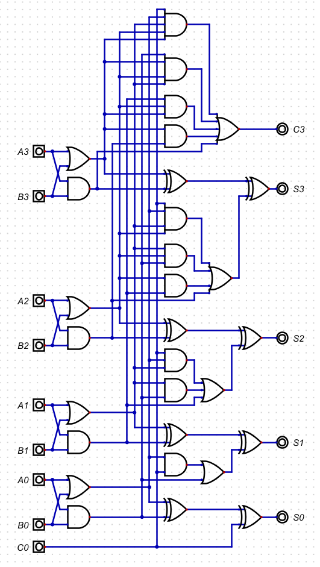
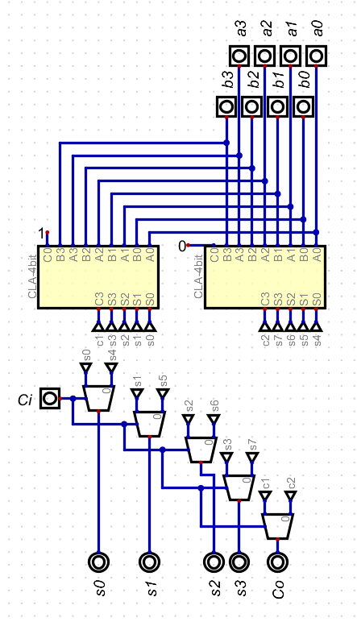
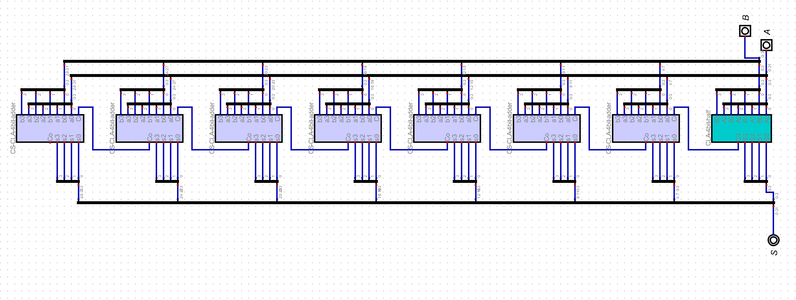
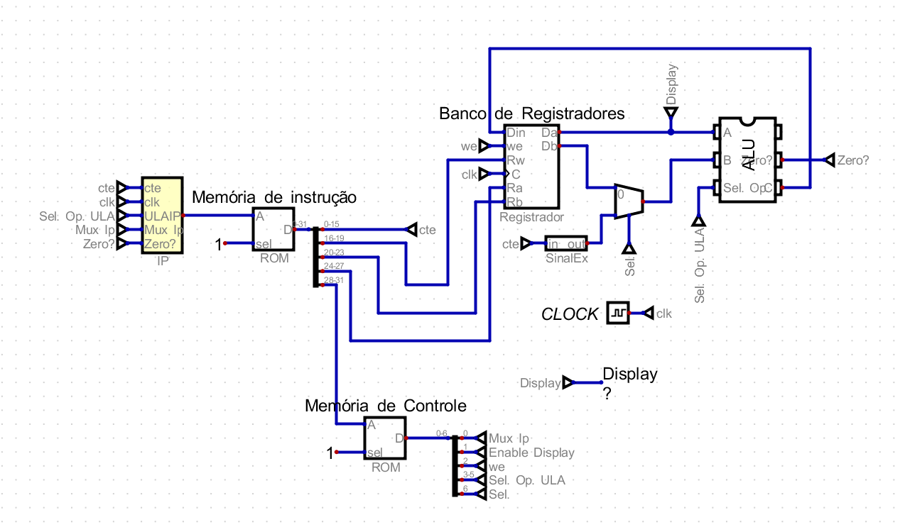

::: acronym
:::

::: IEEEkeywords
MICO X, processador, somador.
:::

# Somador com atraso minimizado

## Carry Lookahead

Em um somador convencional, um Full Adder (FA) depende do carry de outro
anterior, ou seja, a soma acontece linearmente e cada FA espera o
anterior finalizar para iniciar as operações. Para evitar esse
imbróglio, pode-se calcular, antecipadamente, se terá ou não algum
carry. Assim, calcula-se caso o FA anterior gera um novo carry ou
propaga um criado previamente.

Logo, $${C_1} = {G_0} + {P_0} \times {C_0},$$
$${C_2} = {G_1} + {P_1} \times {C_1}, \text{...,}$$
$${C_n} = {G_{(n-1)}} + {P_{(n-1)}} \times {C_{(n-1)}}$$
$$\text{OBS.:} \ {G_i} = {A_i} \times {B_i} \ \text{e} \ {P_i} = {A_i} + {B_i} \ \text{ou}  \ {P_i} = {A_i} \oplus {B_i}$$

\
**Figura 1**: Implementação de um somador de 4 bits com Carry Look
Ahead.

## Carry Select

Semelhantemente, o carry select faz cálculos de maneira paralela ao
carry anterior, assim, faz-se as contas antes do resultado. Dessa
maneira, o número recebido somente escolhe qual resultado já computado é
escolhido.\
Isto posto, cada 4 bit full adder tem 2 similares a Figura 1, tal que
este recebe 0 e aquele recebe 1 e a entrada escolhe o resultado,
diminuindo o tempo de propagação total do circuito.

\
**Figura 2**: Somador de 4 bits com Carry Select.\
\
Junta-se os Full Adders de 4 bits até 32 bits:\
\
**Figura 3**: Implementação completa do somador de 32 bits.

## Conclusão

Portanto, uma implementação de um somador completo de 32 bits, que
experimenta minimizar o tempo de propagação, está completa.

# Testes no MICO X1

\
**Figura 4**: Exemplo de bloco operativo do MICO X1.

## Loop simples

Para fim de testes, será realizado um simples laço de repetição que
contará de 1 até 5 que será colocado na memória de instruções da Figura
4. Em Assembly simples e hexadecimal, sabendo que a operação tem 4 bits,
cada registrador 4 bits e uma constante com 16 bits, totaliza-se 32
bits, assim:\
\
\
0xB0010001\
0xB0020001\
0xB0030005\
0xE2300003\
0x12120000\
0xD000FFFE\
0xF0000000\
